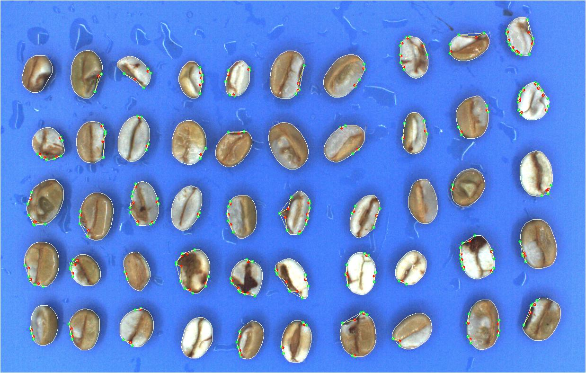

# Coffee Analysis

This repo shows a few samples of image processing anylysis on wet coffe beans. It's a free choice project for the final capstone project of th C++ Nanodegree.

## How to compile and run

It runs with C++17, -pthreads and CMake together with [OpenCV 4.x](https://docs.opencv.org/master/d7/d9f/tutorial_linux_install.html).
The File `CMakeLists.txt` in the root directory configures the build process


The repo works with cmake:

```
mkdir build
cd build
cmake ..
make
./capstone
```

## Brief Description
Defects to be detected are false elliptical shapes (beans which have suffered from mechanichal damage and beans which were attacked by insects before the harvest.

The algorithm is designed to load images from the folder `images/` and analyze them in multiple threads. This number of threads correspond to the batch size on the main file and can be changed. Tests have been done with up to 10 threads.

The algo also has an extra internal implementation of threads, where an image croped in different subimages and each of them is treated as a separate thread. This method works fine, but its speed is quite slow, compared to sequential execution.

Specifically, the code segments the beans and the analyzes shape (convex hull method) and darkness (hand made convolution).

Defective beans are the ones with mechanical damage (irregular shape) OR dark spots on their surface, as seen in the images.





The terminal output indicates a lot of info for each bean. Each of the has an ID, which is also drawn on the respective image. Since the final application in real life is to sort the out, the centroid of each rejected blob (bean) is marked with a red "X", this information and the exact positon corrdinates are outputted into the terminal.

Additionally, the shape defects are marked in the image and the recognized dark spots are marked in green. This info is also showed on the terminal.

### File and Class Structure


## Project Rubric points Adressed:
#### Loops, Functions, I/O

- The project demonstrates an understanding of C++ functions and control structures -> this can be observed across all files
- The project reads data from a file and process the data, or the program writes data to a file -> `main.cpp 71`

#### Object Oriented Programming

- The project uses Object Oriented Programming techniques. -> `image.cpp` `bean.cpp`
- Classes use appropriate access specifiers for class members. -> `image.h` `bean.h`
- Classes encapsulate behavior -> class `Image` encapsulates image operations, class `Bean` encapsulates bean information and some extra operations done for each "bean" region of the image, based on what the image class is complementing on the bean's attributes.
- Templates generalize functions in the project. -> `vutils.h 29`

#### Memory Management

- The project makes use of references in function declarations. -> `main.cpp 14`
- The project uses move semantics to move data, instead of copying it, where possible. -> `main.cpp 104`
- The project uses smart pointers instead of raw pointers. -> `cv::Mat` is n implementation of shared pointers.

#### Concurrency

- The project uses multithreading. -> `main.cpp 89` `image.cpp 114`
- A promise and future is used in the project.-> `main.cpp 81`
- A mutex or lock is used in the project. -> `image.cpp 150`
