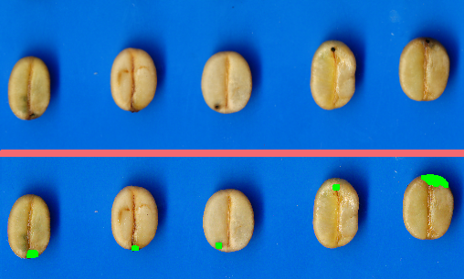

# Coffee Analysis

This repo shows a few samples of image processing anylysis on wet coffe beans.

## How to compile and run

It runs with C++17, -pthreads and CMake together with [OpenCV 4.x](https://docs.opencv.org/master/d7/d9f/tutorial_linux_install.html) nd the boost library.
The File `CMakeLists.txt` in the root directory configures the build process

In order to clone the images you'll need `git lfs`

The repo works with cmake:

```
mkdir build
cd build
cmake ..
make
./capstone
```

## Brief Description
Defects to be detected are false elliptical shapes (beans which have suffered from mechanichal damage and beans which were attacked by insects before the harvest.

The algorithm is designed to load images from the folder `images/` and analyze them in multiple threads. This number of threads correspond to the batch size on the main file and can be changed. Tests have been done with up to 10 threads.

The algo also has an extra internal implementation of threads, where an image croped in different subimages and each of them is treated as a separate thread. This method works fine, but its speed is quite slow, compared to sequential execution.

Specifically, the code segments the beans and the analyzes shape (convex hull method) and darkness (hand made convolution).

Defective beans are the ones with mechanical damage (irregular shape) OR dark spots on their surface, as seen in the images.

The beans on the images are already manually sorted out, i.e. the results of the algorithm should be rejecting all beans except the ones present on the images labelled as "healthy". Of course the algorithm is not always 100% accurate, but still very close.




The terminal output indicates a lot of info for each bean. Each of the has an ID, which is also drawn on the respective image. Since the final application in real life is to sort the out, the centroid of each rejected blob (bean) is marked with a red "X", this information and the exact positon corrdinates are outputted into the terminal.

Additionally, the shape defects are marked in the image and the recognized dark spots are marked in green. This info is also showed on the terminal.

### File and Class Structure

The Code has a class image that takes care of all image related processes like threshholding, extracting regions, and information about the beans.

The image class makes use of another class called Bean, which stores all information related to the beans such as id, locations, defects, etc and also has some static functions to draw the beans.

There are also a `utils` and `vutils` files with helpfull functions to handle files and segmenting a vector into batches respectively.

The `main.cpp` creates a batch of `n` images and starts a thread for each of them, waits until the are done and then starts again with another `n` threads for `n` images.
